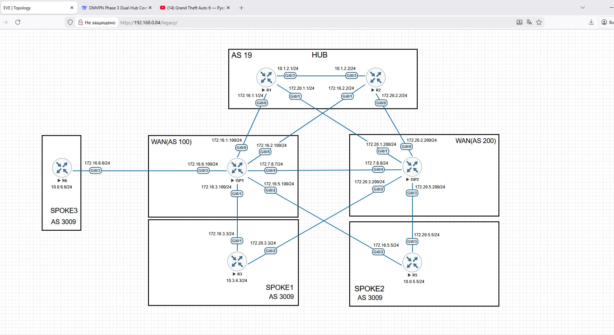
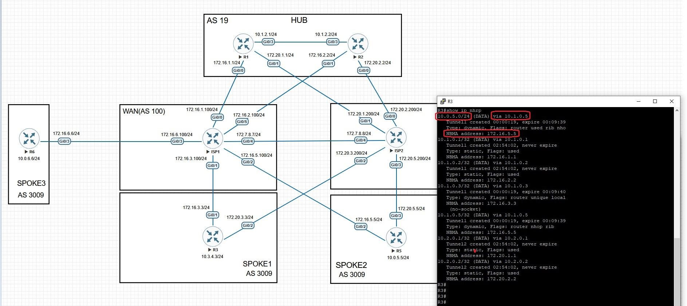

# DMVPN_eBGP_Phase3_with_Dual_Cloud_Dual_Hub

## Описание проекта
Построение отказоустойчивой сети между центральным офисом и удаленными филиалами с использованием двух независимых интернет-каналов.

## 📋 Топология и описание схемы сети

Сеть построена по отказоустойчивой архитектуре DMVPN Phase 3:

Хаб-маршрутизаторы (R1, R2): Два центральных узла в AS19, обеспечивающие избыточность и балансировку нагрузки.

Провайдеры (ISP1, ISP2): Независимые интернет-каналы (AS100, AS200) для двойного подключения.

Spoke-маршрутизаторы:

    R3, R5: полноценное dual-homed подключение к обоим хабам

    R6: single-homed подключение (моделирует филиал с ограниченным бюджетом или тестовую площадку)

DMVPN туннели: Два независимых "облака" (Tunnel1 через ISP1, Tunnel2 через ISP2).

🎯 Типовые сценарии использования:

    Головной офис <-> Филиалы - основная модель

    Филиал <-> Филиал - прямое VoIP/видео общение

    Миграция между провайдерами - без разрыва сессий
    
    Торговые точки и магазины - онлайн-кассы, инвентаризация, ценообразование

## DMVPN_Phase_3: Механизм работы

На HUB специально для Phase 3 настраивается ip nhrp redirect. 
Первый пакет(request) летит в сторону Хаба, потом происходит redirect этого request в сторону R5(SPOKE2),
R5(SPOKE2) принимает этот request, R5(SPOKE2) находит и отвечает в сторону HUB сообщением reply, вкладывая в сеть 10.0.5.5/24 NHRP-reply, 
и этот reply доставляется до SPOKE 1.
Второй пакет пересылается уже на прямую в сторону R5(SPOKE2). 

Если посмотреть команду show ip nhrp, то можно увидеть, что R3(SPOKE1) знает о сети 10.0.5.0/24 через next-hop 10.1.0.5 с NBMA-адресом 172.16.5.5

Это означает, что HUB выполняет:

    Просмотр своей NHRP-таблицы

    Поиск NBMA-адреса удалённого SPOKE

    Пересылку пакетов на уровне DATA PLANE напрямую на SPOKE

🛠 Технологии и протоколы

DMVPN Phase 3: Динамические multipoint туннели с прямым spoke-to-spoke общением

NHRP (Next Hop Resolution Protocol): Для разрешения адресов и автоматического создания прямых туннелей

eBGP (external BGP): Обмен маршрутами между разными AS (19 и 3009)

GRE (Generic Routing Encapsulation): Инкапсуляция для туннелей поверх IP

VRF (Virtual Routing and Forwarding): Изоляция маршрутов для разных провайдеров

Multipath Load Balancing: Балансировка трафика по нескольким путям

🚀 Преимущества 

Отказоустойчивость - при падении одного провайдера или хаба связь сохраняется

Производительность - трафик между филиалами идет напрямую, не нагружая центр

Масштабируемость - легко добавлять новые филиалы без изменения конфигурации на HUB

Надежность - автоматическое переключение при проблемах с каналами связи

Экономичность - возможность комбинировать разные типы подключений (dual-homed + single-homed)

Проект демонстрирует практический подход к построению отказоустойчивых VPN-сетей.